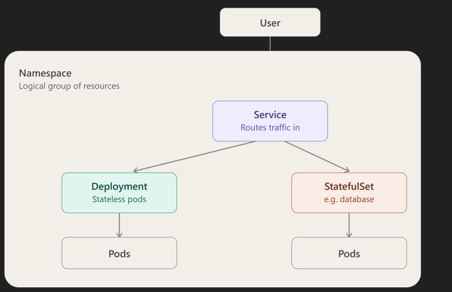
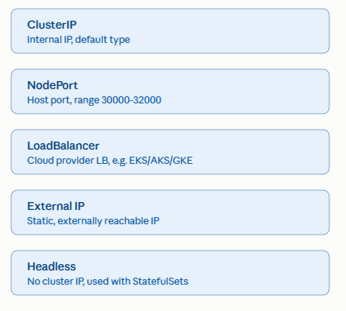
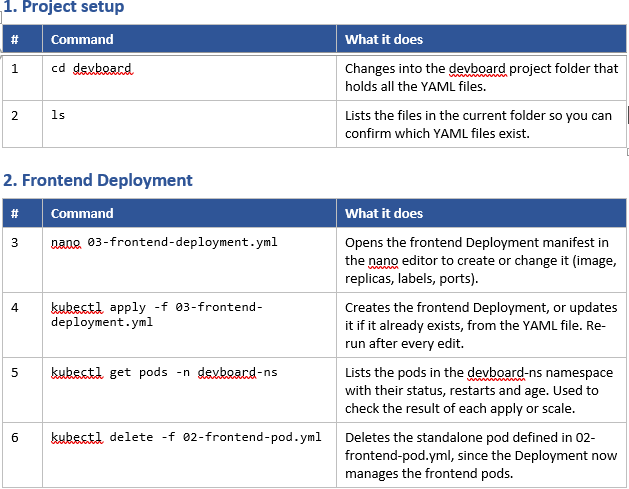
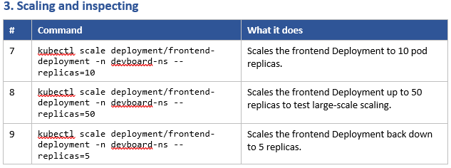
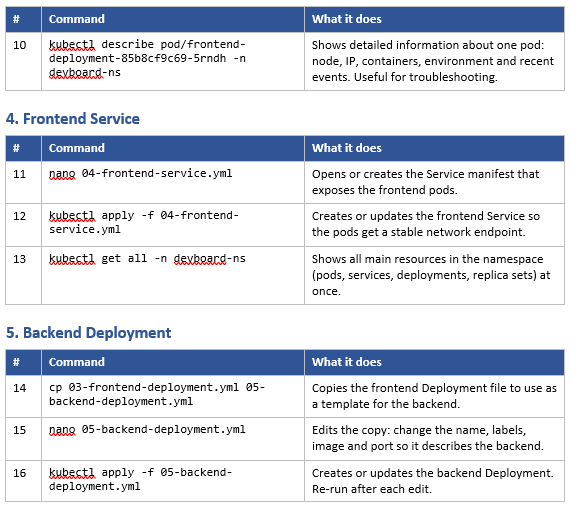
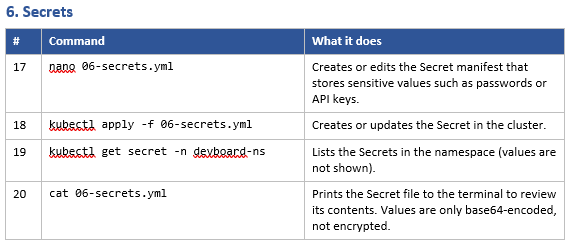
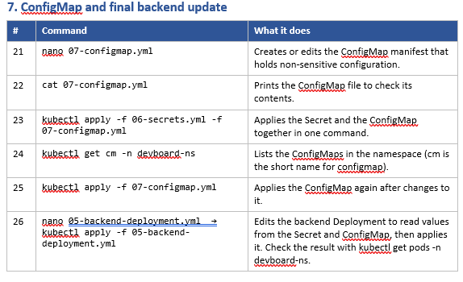

# Day 02 Key Takeaways: Kubernetes Core Concepts

## 1. The Core Idea

The whole point of Kubernetes is to manage **Pods**. Everything else — Namespace, Deployment, Service — exists to support that one job:

- **Create a Namespace** — a logical group in which resources live.
- **Decide the desired state of your Pods** — e.g. "I need 2 pods running." A **Deployment** is what holds and enforces that desired state.

## 2. Core Building Blocks: Namespace, Pod, Deployment/StatefulSet, Service

| Resource | What It Is |
|---|---|
| **Namespace** | A logical group that collects all related resources (pods, deployments, services) together. |
| **Pod** | The resource that actually runs your container(s). It's the smallest deployable unit in K8s. |
| **Deployment** | Manages the desired state of stateless Pods. Its spec contains a template that tells Kubernetes how many replicas (clones) of the pod you want, and how to identify them. |
| **StatefulSet** | Same idea as a Deployment, but for stateful applications (like databases) where pod identity and storage need to persist. |
| **Service** | A stable network endpoint. Since pods are disposable and their IPs change, the Service gives users/other pods one fixed address to talk to, and forwards traffic to whichever pods currently match its selector. |

### Stateless vs Stateful

| App Type | Behavior | Managed By |
|---|---|---|
| Frontend / UI | Stateless — doesn't maintain state | Deployment |
| Database | Stateful — must remember data | StatefulSet |

Here's how these pieces fit together inside a cluster:

## 3. Labels & Selectors — How a Deployment Finds "Its" Pods

A Deployment doesn't track pods by name — it uses labels:

- The Deployment's pod template defines a label (e.g. `app: devboard-fe`).
- The Deployment's selector is the matching criterion — it says "manage every pod whose label matches this."
- Think of it as parent (Deployment) → children (Pods): the label is how the parent recognizes its own children.

## 4. Services — The 5 Types

Since Pods are disposable and their IPs change constantly, a Service gives you one stable address. Kubernetes offers a few flavors of it:

| Service Type | What It Does |
|---|---|
| **ClusterIP** | Internal-only IP so pods/deployments can talk to each other (e.g. an app talking to its database). If you don't specify a type, this is the default. |
| **NodePort** | Every worker node opens the same host port (in the range 30000–32000) that forwards into the service. This is the same idea as `docker run -p 8080:80` — a host port mapped to a container port, just at cluster scale. Example mapping: `nodePort: 31000, port: 80, targetPort: 4173`. |
| **External IP** | ClusterIP is internal; an External IP is a static, publicly reachable address. |
| **LoadBalancer** | Used with managed cloud clusters (EKS, AKS, GKE) — the cloud provider provisions an actual load balancer for you. |
| **Headless** | Used specifically with StatefulSets, where you want to reach individual pods directly rather than through a load-balanced single IP. |

## 5. Kubernetes Commands – devboard Project

### 5.1 Project Setup

### 5.2 Frontend Deployment, Scaling & Inspecting

### 5.3 Inspecting Pods, Frontend Service & Backend Deployment

### 5.4 Secrets

### 5.5 ConfigMap and Final Backend Update

### Command Summary

| Step | Command | Purpose |
|---|---|---|
| 1 | `cd devboard` | Changes into the `devboard` project folder that holds all the YAML files. |
| 1 | `ls` | Lists the files in the current folder so you can confirm which YAML files exist. |
| 2 | `nano 03-frontend-deployment.yml` | Opens the frontend Deployment manifest in the nano editor to create or change it (image, replicas, labels, ports). |
| 2 | `kubectl apply -f 03-frontend-deployment.yml` | Creates the frontend Deployment, or updates it if it already exists, from the YAML file. Re-run after every edit. |
| 2 | `kubectl get pods -n devboard-ns` | Lists the pods in the `devboard-ns` namespace with their status, restarts and age. Used to check the result of each apply or scale. |
| 2 | `kubectl delete -f 02-frontend-pod.yml` | Deletes the standalone pod defined in `02-frontend-pod.yml`, since the Deployment now manages the frontend pods. |
| 3 | `kubectl scale deployment/frontend-deployment -n devboard-ns --replicas=10` | Scales the frontend Deployment to 10 pod replicas. |
| 3 | `kubectl scale deployment/frontend-deployment -n devboard-ns --replicas=50` | Scales the frontend Deployment up to 50 replicas to test large-scale scaling. |
| 3 | `kubectl scale deployment/frontend-deployment -n devboard-ns --replicas=5` | Scales the frontend Deployment back down to 5 replicas. |
| 3 | `kubectl describe pod/frontend-deployment-85b8cf9c69-5rndh -n devboard-ns` | Shows detailed information about one pod: node, IP, containers, environment and recent events. Useful for troubleshooting. |
| 4 | `nano 04-frontend-service.yml` | Opens or creates the Service manifest that exposes the frontend pods. |
| 4 | `kubectl apply -f 04-frontend-service.yml` | Creates or updates the frontend Service so the pods get a stable network endpoint. |
| 4 | `kubectl get all -n devboard-ns` | Shows all main resources in the namespace (pods, services, deployments, replica sets) at once. |
| 5 | `cp 03-frontend-deployment.yml 05-backend-deployment.yml` | Copies the frontend Deployment file to use as a template for the backend. |
| 5 | `nano 05-backend-deployment.yml` | Edits the copy: change the name, labels, image and port so it describes the backend. |
| 5 | `kubectl apply -f 05-backend-deployment.yml` | Creates or updates the backend Deployment. Re-run after each edit. |
| 6 | `nano 06-secrets.yml` | Creates or edits the Secret manifest that stores sensitive values such as passwords or API keys. |
| 6 | `kubectl apply -f 06-secrets.yml` | Creates or updates the Secret in the cluster. |
| 6 | `kubectl get secret -n devboard-ns` | Lists the Secrets in the namespace (values are not shown). |
| 6 | `cat 06-secrets.yml` | Prints the Secret file to the terminal to review its contents. Values are only base64-encoded, not encrypted. |
| 7 | `nano 07-configmap.yml` | Creates or edits the ConfigMap manifest that holds non-sensitive configuration. |
| 7 | `cat 07-configmap.yml` | Prints the ConfigMap file to check its contents. |
| 7 | `kubectl apply -f 06-secrets.yml -f 07-configmap.yml` | Applies the Secret and the ConfigMap together in one command. |
| 7 | `kubectl get cm -n devboard-ns` | Lists the ConfigMaps in the namespace (`cm` is the short name for `configmap`). |
| 7 | `kubectl apply -f 07-configmap.yml` | Applies the ConfigMap again after changes to it. |
| 7 | `nano 05-backend-deployment.yml` → `kubectl apply -f 05-backend-deployment.yml` | Edits the backend Deployment to read values from the Secret and ConfigMap, then applies it. Check the result with `kubectl get pods -n devboard-ns`. |
