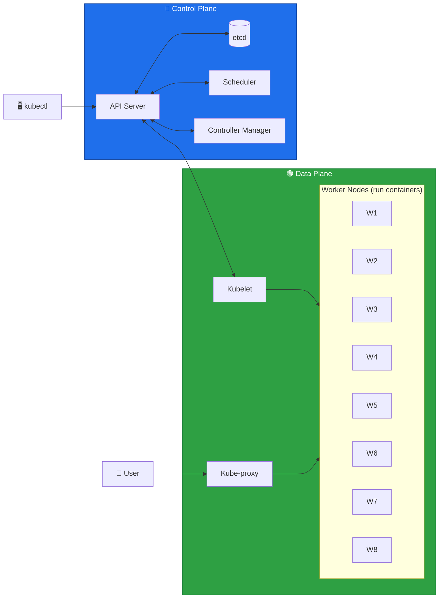
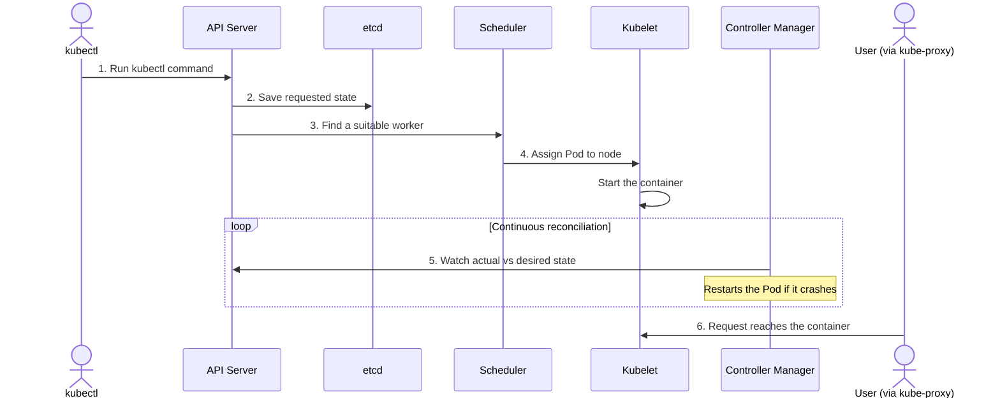

# ☸️ Kubernetes Architecture Cheat Sheet

> A quick-reference guide to the Kubernetes control plane, data plane, and how a request flows through the cluster.

---

## 🧭 The Big Picture

A Kubernetes cluster is like a company:

- 🔵 **Control plane** — the headquarters that makes decisions.
- 🟢 **Data plane** — the workplace where the real work happens.

The control plane manages the cluster's **desired state** — what you've asked Kubernetes to maintain, e.g. *"Run three copies of my website."*

## 🔵 Control Plane Components

| Component | Role | Analogy |
|---|---|---|
| **API Server** | The communication gateway and main entry point for all administrative requests. Every other component talks to it rather than to each other — it authenticates, authorizes, validates requests, and reads/writes cluster state to etcd. | The company's central reception and request desk. |
| **etcd** | A distributed key-value store that persists cluster state: Pod and Deployment definitions, node records, config objects, secrets, and resource status. | The company's official records database. |
| **Scheduler** | Finds Pods that don't yet have a node assigned and picks a suitable node based on requested CPU/memory and available node capacity. | The person who assigns each new task to the right desk. |
| **Controller Manager** | Continuously checks that reality matches the desired state. If a Pod crashes, it starts a replacement. | The team lead making sure headcount stays correct. |

> [!NOTE]
> **Example:** When you request three website replicas, the API server accepts and records the configuration in etcd. The scheduler then assigns each replica to a node, and the controller manager watches to keep three running at all times.

## 🟢 Data Plane Components

The data plane is where your applications actually run — the control plane gives the orders, and the workers do the work.

| Component | Role |
|---|---|
| **Worker Node** (W1–W8) | A machine that runs your containers. |
| **Kubelet** | The manager on each worker. Takes instructions from the API server, then starts, stops and monitors containers on its node. |
| **Kube-proxy** (service proxy) | Handles networking on the worker — routes incoming requests to the right container. |

## 🟣 Outside & Connecting Pieces

| Piece | Role |
|---|---|
| **kubectl** | The CLI you type commands into (e.g. `kubectl get pods`). Sends commands to the API server. |
| **User** | The person or app using your running application, reaching it through kube-proxy. |
| **CNI** (Container Network Interface) | The network plumbing that lets the control plane, workers, and containers talk to each other. |
| **Kubernetes cluster** | The whole thing: control plane + data plane. |

## 🟡 How It All Works Together

1. You run a `kubectl` command, which goes to the API server.
2. The API server saves the request in etcd.
3. The scheduler picks a suitable worker.
4. The kubelet on that worker starts the container.
5. The controller manager keeps watching to make sure it stays healthy.
6. A user's request arrives through kube-proxy and reaches the container.
