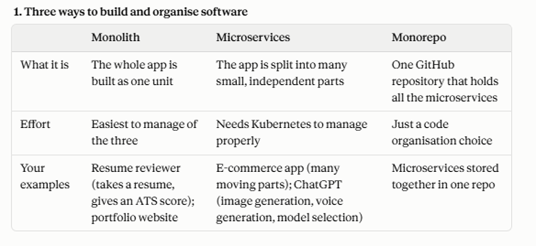
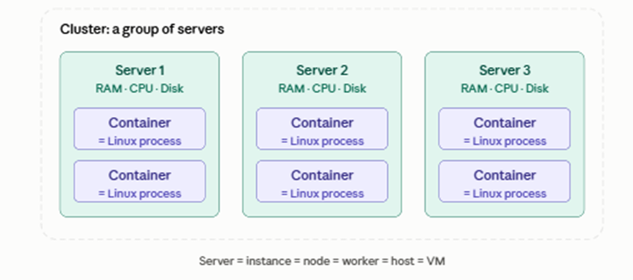

Kubernetes fundamentals: 

The basic building blocks are:

The rule of thumb from the above diagram is that a simple app with one job is a monolith, and an app with many different moving parts is microservices. Microservices are generally deployed on Kubernetes.

What is Kubernetes?
Kubernetes manages many Docker containers (or other containers) so that you can ship software smoothly.

Why do we need it?
•	With Docker alone, managing 1 or 2 containers is easy, but 100 containers become very hard to manage.
•	Microservices can grow rapidly, which raises the chances of crashes, traffic problems and management headaches.
•	The app needs autoscaling and scaling: more copies when traffic rises, fewer when it drops.
•	Kubernetes is a robust orchestration system that lets you create, schedule, delete and inspect containers.

Servers and clusters:

A server is a machine that runs your containers, using Docker or alternatives such as Podman and containerd. Containers are basically Linux processes, and servers run those processes. Every server has resources: RAM, CPU and disk. A cluster is a group of one or many servers.

The diagram below shows how these pieces fit together.

Key terms:

•	Container is a packaged app. Under the hood, it is just an isolated Linux process.
•	Server is a machine with RAM, CPU and disk that runs containers. It is also called an instance, node, worker, host or VM.
•	Cluster is one or many servers grouped together.
•	Orchestration means automatically managing many containers: creating, scheduling, deleting, inspecting and scaling them.
•	Autoscaling means adding or removing containers automatically as traffic changes.
•	ATS is the Applicant Tracking System, which is what your resume reviewer example scores against.

The big idea in one line:

Docker runs containers, and Kubernetes manages hundreds of them across many servers so that microservices apps stay running, scalable and organised.
